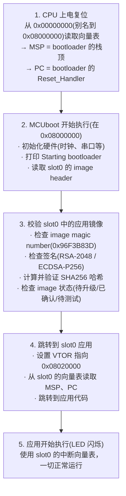
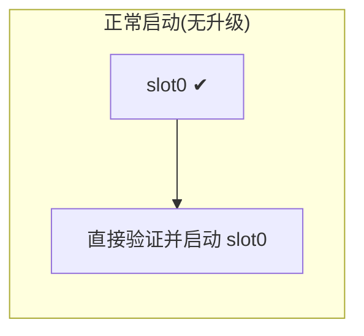
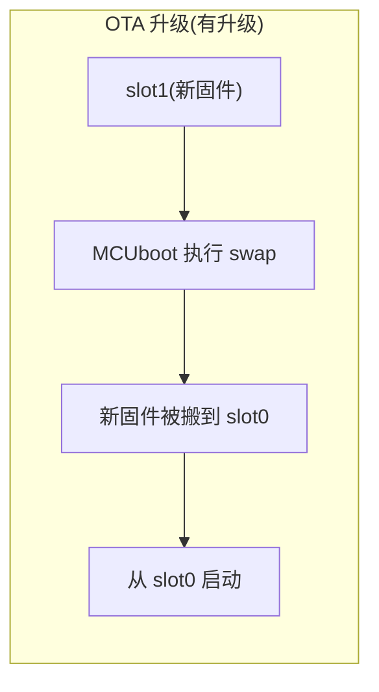
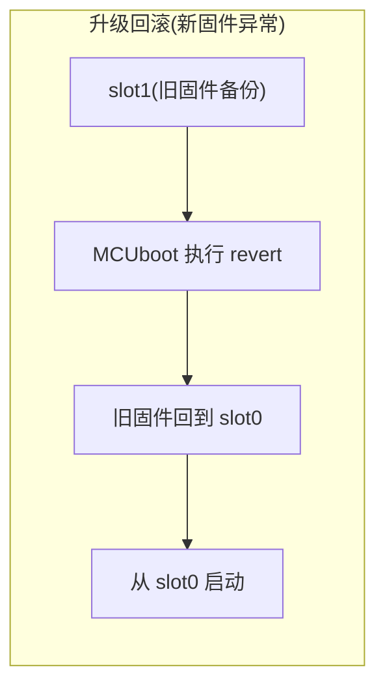
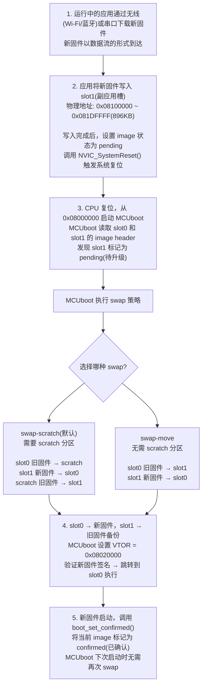
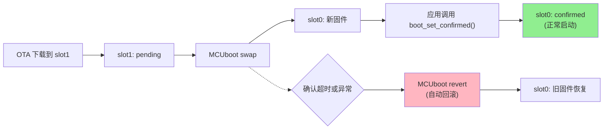

# app95_bootloader — MCUboot Bootloader + LED App

STM32H743 双镜像启动示例：MCUboot bootloader + 应用镜像（LED 闪烁）。

## Flash 分区布局

```
0x08000000 - 0x0801FFFF (128KB): boot_partition — MCUboot bootloader
0x08020000 - 0x080FFFFF (896KB): slot0_partition — 主应用槽
0x08100000 - 0x081DFFFF (896KB): slot1_partition — 副应用槽 (OTA)
0x081E0000 - 0x081FFFFF (128KB): user_data_partition — 用户数据
```

## 编译

```bash
source ~/program/zephyrproject/.venv_zephyr/bin/activate
export ZEPHYR_BASE=~/program/zephyrproject/zephyr

cd ~/study/stm32h743_user
west build -p always -b stm32h743_user --sysbuild app95_bootloader/
```

## 烧录

烧录 MCUboot 到内部 Flash 起始位置:

```bash
west flash -d build/mcuboot
```

烧录签名后的应用镜像 (slot0):

```bash
west flash -d build/app95_bootloader
```

### west flash 如何知道烧录到哪个地址？

`west flash` 通过**编译产物中的 devicetree 信息**确定烧录地址。流程如下：

1. **编译阶段**：Zephyr 的构建系统读取 devicetree overlay 文件，将分区定义写入编译产物
2. **烧录阶段**：`west flash` 读取编译目录下的 `.config` 和 `zephyr.rane`（或 `devicetree_generated.h`），获取目标分区的起始地址和大小

关键在于 devicetree overlay 中的 `zephyr,code-partition` 选择节点：

**MCUboot (build/mcuboot)**:
```dts
/* mcuboot/boards/stm32h743_user.overlay */
chosen {
    zephyr,code-partition = &boot_partition;  // ← 指向 boot_partition
};
```
→ `west flash -d build/mcuboot` 烧录到 `boot_partition`（0x08000000）

**应用程序 (build/app95_bootloader)**:
```dts
/* boards/stm32h743_user.overlay */
chosen {
    zephyr,code-partition = &slot0_partition;  // ← 指向 slot0_partition
};
```
→ `west flash -d build/app95_bootloader` 烧录到 `slot0_partition`（0x08020000）

```
west flash 读取的烧录地址来源:
├── build/mcuboot/
│   ├── .config                    # 包含 CONFIG_FLASH_BASE_ADDRESS=0x08000000
│   └── zephyr/
│       └── devicetree_generated.h # 包含 boot_partition 的地址定义
│
└── build/app95_bootloader/
    ├── .config                    # 包含 CONFIG_FLASH_BASE_ADDRESS=0x08000000
    └── zephyr/
        └── devicetree_generated.h # 包含 slot0_partition 的地址定义
```

## 启动原理说明

### CPU 如何知道 Flash 中有没有程序？

**CPU 并不知道 Flash 里有程序，它只是无条件地执行。**

STM32H743 使用 ARM Cortex-M7 内核，其启动流程完全由硬件固件决定：

1. **上电/复位后**，CPU 从代码区（`0x00000000` 起始）读取两个字：
   - `0x00000000` → **MSP**（主堆栈指针初始值）
   - `0x00000004` → **PC**（程序计数器，即第一条指令地址）
2. 这两个字就是**向量表**的头两项。CPU 将它们加载后，直接跳转到 PC 指向的地址开始执行。
3. **Flash 永远不会"空"**：Flash 是**非易失性存储器**，写入什么就是什么。如果从未烧录过（全 `0xFF`），CPU 会读到：
   - MSP = `0xFFFFFFFF`（非法地址）
   - PC = `0xFFFFFFFF`（非法地址）
   - 这会导致**立即触发硬件异常（HardFault）**，CPU 进入故障状态，不会有任何输出。

所以 CPU 根本不会去"检测有没有程序"——它只是忠实地执行向量表指向的代码，程序是否存在取决于 Flash 里实际写入的内容。

### CPU 如何知道 Flash 的空间划分？

**CPU 也不知道。Flash 分区完全是软件层面的约定。**

Cortex-M7 的内存映射是固定的：
- 内部 Flash 物理地址：`0x08000000` ~ `0x081FFFFF`（STM32H743XI = 2MB）
- 上电时根据 BOOT 引脚，Flash 被别名映射到 `0x00000000` 起始的代码区

而 MCUboot 的分区方案（128KB boot + 896KB slot0 + 896KB slot1 + 128KB user data）是**在 device tree overlay 中定义的软件约定**：

```dts
&flash0 {
    partitions {
        boot_partition: partition@0    { reg = <0x00000000 0x20000>; };  // 128KB
        slot0_partition: partition@20000 { reg = <0x00020000 0xE0000>; }; // 896KB
        slot1_partition: partition@100000 { reg = <0x00100000 0xE0000>; }; // 896KB
        user_data_partition: partition@1E0000 { reg = <0x001E0000 0x20000>; }; // 128KB
    };
};
```

这里的地址是**相对 Flash 基地址（`0x08000000`）的偏移量**，实际物理地址 = `0x08000000 + 偏移`。

> **Flash 控制器和 MMU 都不参与分区——分区只存在于软件层面。**

### 双镜像启动完整流程



### VTOR 是关键

Cortex-M7 提供一个特殊寄存器 **VTOR**（`SCB->VTOR`，地址 `0xE000ED08`），它告诉 CPU 中断向量表存放在哪个地址。

- **没有 VTOR**：中断向量表只能固定在 `0x00000000`，无法实现双镜像启动。
- **有了 VTOR**：MCUboot 在跳转前执行 `SCB->VTOR = 0x08020000`，CPU 就知道所有中断都去 slot0 查找对应的处理函数。

这就是为什么 bootloader 跳转应用后，应用的中断仍然能正常工作的原因——VTOR 指向了应用的向量表。

### MCUboot 能默认启动 slot1 中的程序吗？

**不能。MCUboot 默认只从 slot0（主应用槽）启动。**

这是 MCUboot 的安全设计原则——**主槽永远是启动目标**，slot1 仅作为升级暂存区：







所以 slot1 中的镜像**永远不会被直接执行**，它只有两种命运：

| 场景           | slot1 的内容 | MCUboot 的处理                        |
| -------------- | ------------ | ------------------------------------- |
| **正常状态**   | 无有效镜像   | 忽略 slot1，直接从 slot0 启动         |
| **OTA 升级中** | 新版本镜像   | 执行 swap 搬到 slot0，再从 slot0 启动 |

这样的设计保证了：

1. **启动路径唯一**：CPU/VTOR 永远跳转到 slot0 的固定地址 `0x08020000`，没有二义性。
2. **升级安全**：升级失败时 slot0 的原固件被 swap 到 slot1，可以随时回滚。
3. **中断向量表稳定**：应用只需知道自己固定在 slot0，VTOR 写死一个值即可。

> **如果想直接从 slot1 启动**（跳过 swap），需要启用 `CONFIG_BOOT_DIRECT_XIP` 并将 `zephyr,code-partition` 指向 `&slot1_partition`。但这会破坏 MCUboot 的标准升级流程，仅适用于特殊场景（如双系统冷备份）。

### OTA 升级流程详解



**OTA 升级中的关键概念：**

| 概念          | 说明                                                       |
| ------------- | ---------------------------------------------------------- |
| **pending**   | 新固件已写入 slot1，待 MCUboot 执行 swap                   |
| **confirmed** | slot0 中的固件已验证通过，标记为"已确认"，下次复位不会回滚 |
| **swap**      | MCUboot 将 slot0 和 slot1 的内容互换（带原固件备份）       |
| **revert**    | 确认超时或异常时，MCUboot 自动将旧固件换回 slot0（回滚）   |

**升级状态迁移图：**



**典型 OTA 代码片段（参考 `app90_ota`）：**

```c
/* 应用收到新固件后，写入 slot1（使用 flash API）*/
/* 写入完成后，标记升级并复位 */
boot_request_upgrade(BOOT_UPGRADE_TEST);
sys_reboot(SYS_REBOOT_COLD);

/* 新固件启动后，确认升级成功 */
boot_set_confirmed();
```

